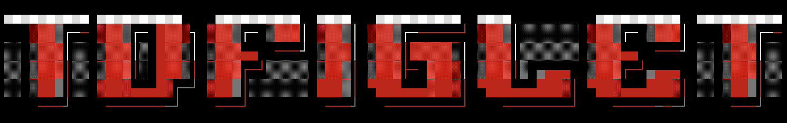

# tdfiglet

A Go library for rendering large ASCII art text using [TheDraw](https://en.wikipedia.org/wiki/TheDraw) color font (`.tdf`) files.



## Features

- Load TheDraw FONTS (`.tdf`) color bitmap fonts
- Per-glyph foreground and background colors
- ANSI terminal escape sequences or mIRC color codes
- CP437 to UTF-8 conversion for Unicode terminals, or raw IBM bytes
- Left, center, and right justification within a configurable width

## Installation

```bash
go get github.com/kellegous/tdfiglet@latest
```

## Usage

Load a font by path and render text with default options (left-aligned, 80 columns, ANSI colors, Unicode encoding):

[example]: # "example_test.go:ExampleLoadFontFile"

```go
import (
	"fmt"
	"log"
	"github.com/kellegous/tdfiglet"
)

font, err := tdfiglet.LoadFontFile("fonts/brndamgx.tdf")
if err != nil {
	log.Fatal(err)
}
fmt.Println(font.Render("hello"))
```

### Render options

Use `RenderWith` to control layout, colors, and encoding:

[example]: # "example_test.go:ExampleFont_RenderWith"

```go
import (
	"fmt"
	"log"
	"github.com/kellegous/tdfiglet"
)

font, err := tdfiglet.LoadFontFile("fonts/brndamgx.tdf")
if err != nil {
	log.Fatal(err)
}
fmt.Println(font.RenderWith("hello", tdfiglet.RenderOptions{
	Justify: tdfiglet.JustifyCenter,
	Width:   80,
	Color:   tdfiglet.ColorANSI,
}))
```

Zero values in `RenderOptions` use library defaults: left justify, width 80, ANSI color, Unicode encoding.

## Fonts

This library reads TheDraw color font files (type 2). Fonts are not embedded in the library, but you can copy those you want to use from the [fonts](fonts) directory.

Supported characters are the 94 printable ASCII glyphs (`!` through `~`).

## Acknowledgments

This library is an approximate port of the C program [tdfiglet](https://github.com/tat3r/tdfiglet). In fact, this library is currently tested against the C implementation.

## License

MIT — see [LICENSE](LICENSE).
